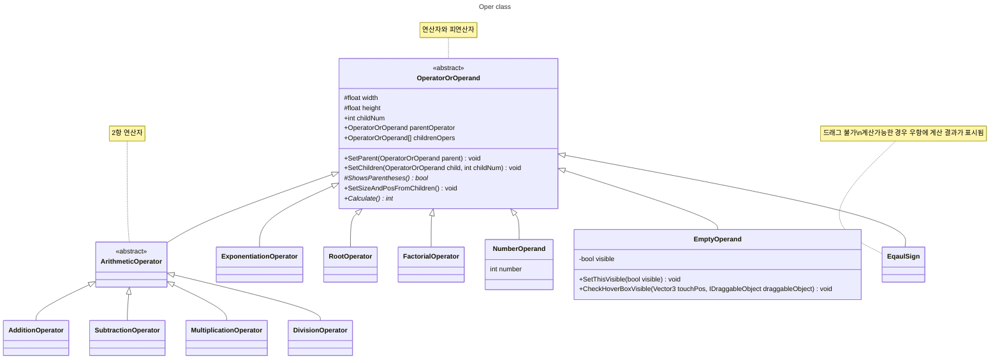

# Pharaoh Code+

보드게임 `파라오 코드`의 강화판을 모바일로 가볍게 구현해본 개인 프로젝트
- Unity 사용
- `파라오 코드`의 규칙인 사칙연산 외에도 제곱, 제곱근, 팩토리얼을 사용 가능

## 플레이 방법
1. `Start` 버튼을 눌러 게임을 시작

   
2. 제한시간동안 피라미드 위의 숫자를 오른쪽으로 드래그
   - 제한시간은 설정에서 변경 가능
   - 제한시간이 모두 끝나면 피라미드의 숫자를 드래그할 수 없음
   - 드래그한 수는 두루마리 위에 남음
   
   
4. 3개의 무작위 수와 7개의 연산자를 이용해 두루마리로 드래그한 수를 만듦
   - 최소 2개 이상의 수를 이용해야 함
   - 3개의 수는 각각 `1~8`, `1~10`, `1~12` 중 무작위로 정해짐
   - 7개의 연산자는 `+`, `-`, `×`, `÷`, `n제곱`, `√`, `!`
   - 연산자 버튼을 누르면 해당하는 연산자 블록이 나
   - 수를 만드는데 성공하면 점수를 획득
   - 획득하는 점수는 수를 만들 수 있는 난이도에 따라 달라짐 *(노란색: 1\~2점, 파란색: 3\~4점, 빨간색: 5\~6점, 보라색: 7점)*
  
   
   
   
   
   
5. `Roll Dice` 버튼을 눌러 주사위를 다시 굴려 2번 과정부터 반복
   - 만약 두루마리에 수가 남아있다면 `Roll Dice` 대신 `Give Up` 버튼을 눌러 점수가 차감되고 주사위를 다시 굴릴 수 있다.
   - 4가지 색상 중 하나 이상의 색상의 수를 모두 사용하면 게임 종료
   
   

## Class 구조
- 연산자는 자식의 width와 hegiht에 따라 크기가 조정됨
- 가장 하위의 child는 NumberOperand여야 계산 가능
- 계산이 불가능한 경우(0으로 나눔, 결과가 정수가 아님, int 범위를 넘음, 숫자를 1개 이하로 사용 등) 계산 결과가 표시되지 않음
- 계산이 가능한 경우 등호의 우항에 결과가 자동으로 표시됨
- 부모 연산자와 자식의 관계에 따라 괄호가 자동으로 표시됨
- 아래 Class Diagram에서 관계성이 적은 변수와 method는 생략함

